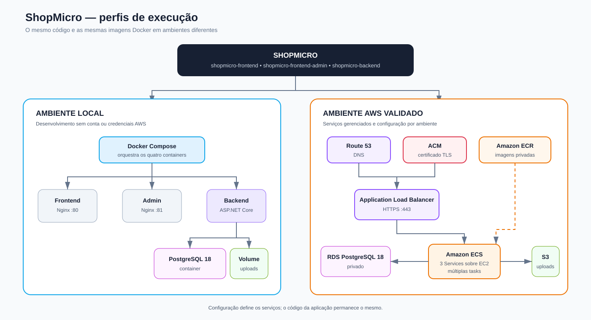
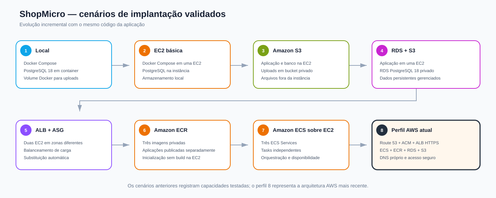

# ShopMicro

ShopMicro é um projeto de estudo e portfólio criado para praticar containers,
serviços AWS e decisões de arquitetura em nuvem por meio de um marketplace
funcional.

A aplicação funciona localmente com Docker Compose e também foi implantada e
validada na AWS, sempre considerando custo, segurança e desempenho. O projeto
foi construído com apoio de IA generativa, com requisitos, testes e decisões
técnicas conduzidos pelo autor.

## Funcionalidades

- Catálogo, busca, categorias e carrinho
- Cadastro e autenticação de clientes
- Checkout, consulta e cancelamento de pedidos
- Painel administrativo
- Gestão de produtos, pedidos, clientes e administradores
- Upload de imagens localmente ou no S3

## Tecnologias

- HTML, CSS, JavaScript e Nginx
- ASP.NET Core 8 e Entity Framework Core
- PostgreSQL 18
- JWT com refresh token
- Docker Compose
- ECS sobre EC2, ECR, ALB, RDS, S3 e IAM
- Route 53, ACM, Parameter Store e SSM Session Manager

## Execução local

Requisitos: Docker Engine e Docker Compose v2.

```bash
cd infra
cp .env.example .env
# Edite .env e defina uma senha administrativa forte.
docker compose up --build
```

| Serviço | Endereço |
|---|---|
| Marketplace | http://localhost |
| Painel administrativo | http://localhost:81 |
| Swagger | http://localhost:8080/swagger |
| PostgreSQL | localhost:5432 |

Na primeira execução, `ADMIN_BOOTSTRAP_EMAIL` e
`ADMIN_BOOTSTRAP_PASSWORD` criam a conta administrativa inicial. As variáveis
são ignoradas depois que uma conta administrativa já existe. O arquivo `.env`
não é versionado.

```bash
# Parar preservando os dados
docker compose down

# Parar e remover banco e uploads locais
docker compose down -v
```

> PostgreSQL 18 utiliza o volume em `/var/lib/postgresql`. Volumes de versões
> anteriores devem ser migrados ou recriados.

## Arquitetura local e AWS

O ShopMicro utiliza o mesmo código e as mesmas imagens Docker nos dois
ambientes. Banco, armazenamento e serviços de infraestrutura mudam por
configuração, sem alterar as regras de negócio.

[](docs/architecture/deployment-profiles.drawio)

| Componente | Ambiente local | Ambiente AWS validado |
|---|---|---|
| Execução | Docker Compose | Amazon ECS sobre EC2 |
| Backend | Container ASP.NET Core | ECS Service independente |
| Interfaces | Dois containers Nginx | Dois ECS Services independentes |
| Banco | PostgreSQL 18 em container | RDS PostgreSQL 18 privado |
| Imagens de produtos | Volume Docker | Bucket S3 privado |
| Imagens dos containers | Build local | Repositórios privados no ECR |
| Entrada | `localhost:80` e `localhost:81` | Application Load Balancer |
| DNS e HTTPS | Não necessários | Route 53 e certificado ACM |
| Segredos | Variáveis locais | Parameter Store |
| Permissões | Sem dependência de IAM | IAM Roles |
| Administração | Docker local | SSM Session Manager, sem SSH público |

### Configuração por ambiente

O backend seleciona os serviços por variáveis de ambiente:

```env
# Local
STORAGE_PROVIDER=Local
DB_CONNECTION_STRING=Host=postgres;Port=5432;Database=shopdb;...

# AWS
STORAGE_PROVIDER=S3
S3_BUCKET_NAME=nome-do-bucket
AWS_REGION=região-escolhida-para-o-ambiente
DB_CONNECTION_STRING=Host=endpoint-do-rds;Port=5432;Database=shopdb;...
```

- `JWT_SECRET` deve ser diferente e protegido em cada ambiente.
- `ADMIN_BOOTSTRAP_EMAIL` e `ADMIN_BOOTSTRAP_PASSWORD` são usados somente para
  criar a primeira conta administrativa.
- `CORS_ALLOWED_ORIGINS` restringe as origens aceitas pelo backend.
- `BACKEND_UPSTREAM` informa aos containers Nginx como alcançar o backend.

Na AWS, credenciais não ficam no código: IAM Roles autorizam o acesso ao S3 e
o Parameter Store entrega os valores sensíveis.

## Cenários de implantação validados

Além do ambiente local e da arquitetura AWS atual, a aplicação foi executada em
configurações intermediárias. Cada cenário introduziu uma capacidade sem exigir
uma versão diferente do código.

[](docs/architecture/validated-profiles.drawio)

| Perfil | Aplicação | Banco | Arquivos | Capacidade validada |
|---|---|---|---|---|
| Local | Docker Compose | PostgreSQL em container | Volume Docker | desenvolvimento sem AWS |
| EC2 básica | Docker Compose em uma EC2 | PostgreSQL na EC2 | Volume Docker | execução em máquina virtual |
| Armazenamento externo | Docker Compose em uma EC2 | PostgreSQL na EC2 | Amazon S3 | arquivos fora da instância |
| Dados gerenciados | Docker Compose em uma EC2 | Amazon RDS | Amazon S3 | banco e arquivos persistentes |
| Múltiplas instâncias | ALB e ASG com duas EC2 | Amazon RDS | Amazon S3 | distribuição entre zonas |
| Imagens centralizadas | ALB e ASG consumindo ECR | Amazon RDS | Amazon S3 | entrega por imagens independentes |
| Orquestração | Amazon ECS sobre EC2 | Amazon RDS | Amazon S3 | Services e tasks independentes |
| Acesso seguro atual | ECS, ALB e Route 53 | Amazon RDS | Amazon S3 | DNS próprio e HTTPS com ACM |

Esses perfis representam cenários efetivamente testados. A última linha é a
arquitetura AWS mais recente; as anteriores registram a portabilidade da
aplicação e as decisões que levaram ao desenho atual.

## Decisões de arquitetura

| Decisão | Motivo |
|---|---|
| PostgreSQL local e RDS na AWS | Preservar o mesmo banco nos dois ambientes |
| Volume local e S3 na AWS | Simplificar o desenvolvimento e externalizar arquivos na nuvem |
| ECS sobre EC2 | Praticar cluster, Capacity Provider, ASG e capacidade computacional |
| Três ECS Services | Implantar frontend, painel administrativo e backend separadamente |
| ALB com regras por host e caminho | Compartilhar uma entrada entre as interfaces e a API |
| SSM no lugar de SSH | Administrar as instâncias sem expor a porta 22 |
| Route 53 e ACM | Usar DNS próprio, HTTPS e certificado gerenciado |
| Identidades separadas | Isolar contas e sessões do marketplace das contas administrativas |
| Migrations do EF Core | Evoluir o PostgreSQL local e o RDS preservando dados existentes |

Fluxo principal de uma requisição na AWS:

```text
Usuário → Route 53 → ALB HTTPS → regra por host e caminho → ECS Service
                                                             │
                                                          backend
                                                        ┌────┴────┐
                                                        RDS       S3
```

## Validações realizadas

- Execução completa no Docker Compose local.
- Cadastro e persistência de produtos no PostgreSQL.
- Upload de imagens em volume local e no Amazon S3.
- Conexão privada entre o backend no ECS e o RDS.
- Distribuição e substituição de tasks pelo ECS.
- Pull independente das três imagens pelo Amazon ECR.
- Health checks do ALB e dos ECS Services.
- Roteamento separado para marketplace, painel administrativo e API.
- DNS próprio e redirecionamento de HTTP para HTTPS.
- Administração das instâncias EC2 somente pelo SSM Session Manager.
- Separação entre contas, tokens e endpoints do marketplace e da administração.
- Migration dos usuários existentes sem perda dos perfis cadastrados.

## Segurança aplicada

- RDS sem acesso público.
- Bucket S3 privado e acessado pelo backend por IAM Role.
- Security Groups com origem em outros Security Groups quando aplicável.
- Segredos entregues às tasks pelo Parameter Store.
- EC2 sem SSH público e administradas pelo SSM Session Manager.
- HTTPS terminado no Application Load Balancer.
- Painel administrativo publicado por domínio próprio, sem exposição da porta
  externa 81 na AWS.
- Tabelas `marketplace_accounts` e `administrative_accounts` independentes.
- Policies JWT exigindo papel e escopo de identidade.
- Refresh tokens separados por contexto e armazenados em cookies `HttpOnly`.

Validação automatizada da fronteira de identidade:

```bash
SHOPMICRO_TEST_ADMIN_EMAIL='seu-admin' \
SHOPMICRO_TEST_ADMIN_PASSWORD='sua-senha' \
./tests/identity-boundary.sh
```

## Limitações atuais

O ambiente AWS foi dimensionado para estudo e validação arquitetural, não como
uma configuração pronta para produção:

- RDS em Single-AZ.
- Cluster ECS com instâncias de pequeno porte.
- Imagens do ECR ainda publicadas com a tag mutável `latest`.
- Deployments executados manualmente.
- Sem autoscaling baseado em métricas da aplicação.
- Observabilidade limitada a logs e health checks.
- Cache, filas, workers e CI/CD ainda não implementados.

## Estrutura

```text
shopmicro/
├── shopmicro-backend/
├── docs/
│   ├── architecture/
│   └── database/
├── shopmicro-frontend/
├── shopmicro-frontend-admin/
└── infra/
    └── compose.yaml
```

## Modelo de dados

O PostgreSQL separa contas e sessões do marketplace das identidades
administrativas. Pedidos e itens preservam snapshots para manter o histórico
mesmo depois de alterações em contas ou produtos.

Consulte a [documentação e o diagrama do banco](docs/database/README.md).

## Próximos passos

O projeto será ampliado com testes automatizados adicionais, cache, filas,
workers, eventos, observabilidade e CI/CD, preservando a execução local e na
AWS.
