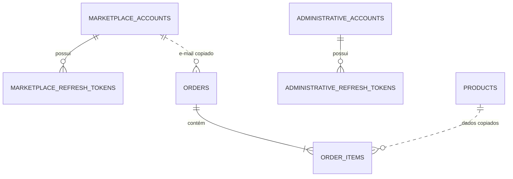

# Banco de dados do ShopMicro

O ShopMicro utiliza PostgreSQL 18 no Docker Compose local e no Amazon RDS. O
mesmo modelo é aplicado nos dois ambientes por migrations do Entity Framework
Core.

## Visão geral

[Abrir o diagrama editável no Draw.io](shopmicro-database.drawio)



As linhas pontilhadas não representam chaves estrangeiras. Pedidos preservam
um snapshot dos dados do cliente e do produto para que o histórico não seja
alterado quando uma conta ou produto mudar.

## Tabelas

| Tabela | Responsabilidade |
|---|---|
| `marketplace_accounts` | Identidade e perfil dos clientes do marketplace |
| `administrative_accounts` | Identidade da equipe com acesso ao painel administrativo |
| `marketplace_refresh_tokens` | Sessões renováveis vinculadas aos clientes |
| `administrative_refresh_tokens` | Sessões renováveis vinculadas aos administradores |
| `products` | Catálogo, preço, categoria, estoque e referência da imagem |
| `orders` | Pedido e snapshot dos dados do cliente no momento da compra |
| `order_items` | Itens, quantidades e snapshot do nome e preço dos produtos |
| `__EFMigrationsHistory` | Registro interno das migrations já aplicadas |

## Fronteira de identidade

Clientes e administradores não compartilham tabela, endpoint de login ou
refresh token.

```text
Marketplace                         Administração
marketplace_accounts                administrative_accounts
        │                                    │
marketplace_refresh_tokens          administrative_refresh_tokens
        │                                    │
/api/marketplace                    /api/administration
```

Essa separação reduz o risco de uma conta do marketplace receber acesso
administrativo por alteração indevida de um campo de perfil.

## Relacionamentos

### Contas e sessões

- Uma conta pode possuir vários refresh tokens.
- A exclusão da conta remove seus refresh tokens em cascata.
- Somente o hash do refresh token é persistido no banco.

### Pedidos

- Um pedido possui um ou mais itens.
- A exclusão de um pedido remove seus itens em cascata.
- `orders.CustomerEmail` identifica o histórico do cliente, mas não é uma
  chave estrangeira para `marketplace_accounts`.
- Os dados pessoais gravados no pedido são o retrato informado na compra.

### Produtos e itens

- `order_items.ProductId` registra o identificador do produto comprado, sem
  chave estrangeira.
- Nome e preço são copiados para o item, preservando o histórico mesmo que o
  catálogo seja atualizado.

## Evolução do esquema

O backend executa `Database.Migrate()` durante a inicialização. Para consultar
as migrations disponíveis:

```bash
dotnet tool restore
dotnet dotnet-ef migrations list \
  --project shopmicro-backend/src/Api/Api.csproj \
  --startup-project shopmicro-backend/src/Api/Api.csproj \
  --no-connect
```

Para criar uma migration durante o desenvolvimento:

```bash
dotnet dotnet-ef migrations add NomeDaAlteracao \
  --project shopmicro-backend/src/Api/Api.csproj \
  --startup-project shopmicro-backend/src/Api/Api.csproj \
  --output-dir Migrations
```

## Regras de manutenção

- Não alterar tabelas manualmente no PostgreSQL ou no RDS.
- Criar e revisar uma migration para cada mudança de esquema.
- Fazer backup do banco local e snapshot do RDS antes de migrations sensíveis.
- Nunca armazenar senha, access token ou refresh token em texto puro.
- Usar uma conta PostgreSQL da aplicação com privilégios mínimos.
- Validar migrations em banco novo e em cópia de um banco com dados.
